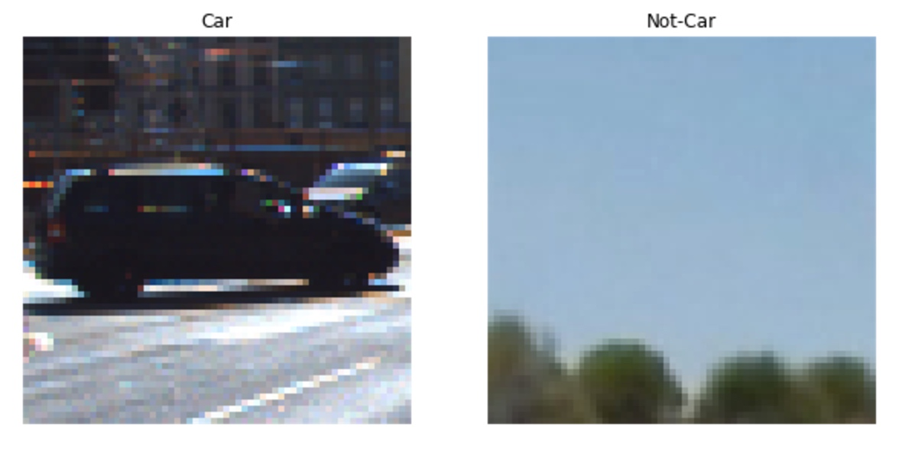
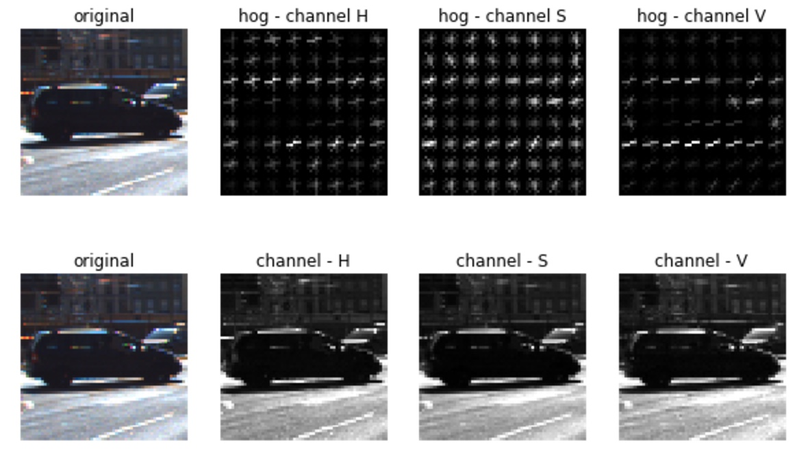
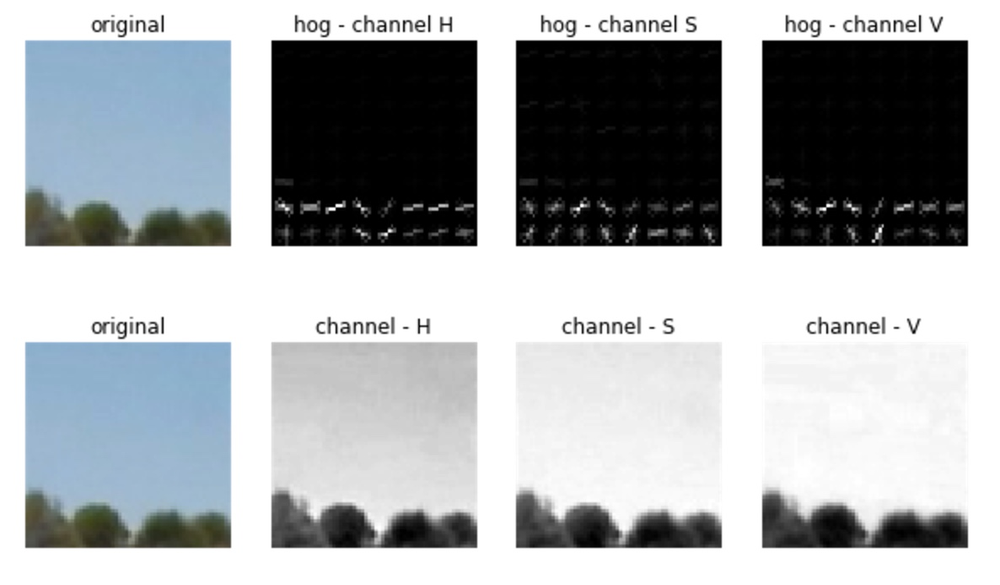
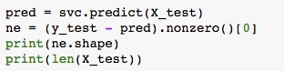
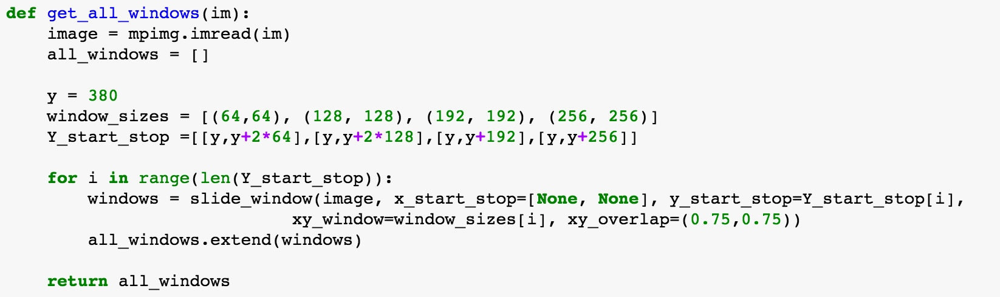
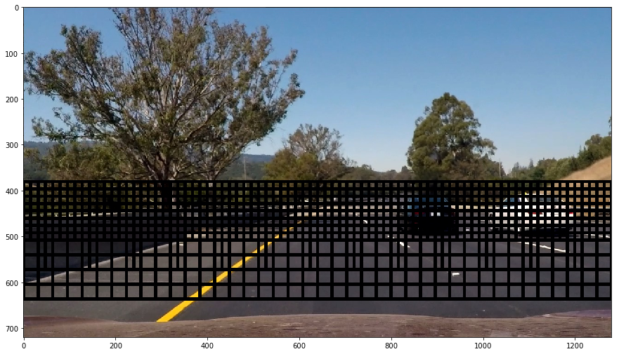
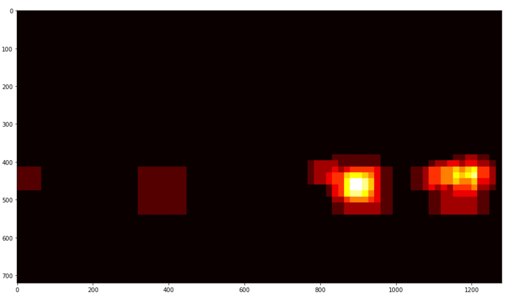
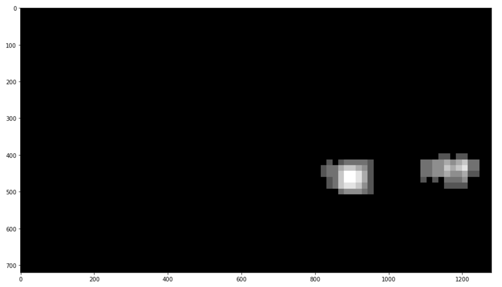
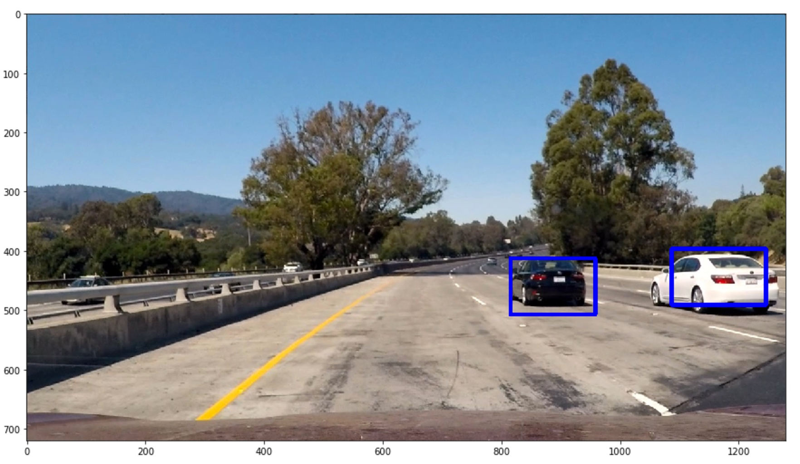

# Objective

The objective of this project is to detect vehicles in a given video. We acheive this by using HOG (History of Gradients) and SVM (Support Vector Machine) classifier. 

We are provided with labeled data on what constitutes a car and what constitutes not a car. We use these images (`cars` and `notcars`) and extract features which define the images. We cannot just use features like shape, size, color as they can be very different among different cars and different light condtions. We would need something that is resistive to change of color, orientation and light conditions on the object in an image. This can be acheived by using History of Gradients. 

The idea behind HoG is that local object apperance and shape can be described by the distribution of intensity gradients or edge directions. The image is divided into small connected regions called cells, and for the pixels within each cell, a histogram of gradient directions is compiled. The descriptor is the concatenation of these histograms. For improved accuracy, the local histograms can be contrast-normalized by calculating a measure of the intensity across a larger region of the image, called a block, and then using this value to normalize all cells within the block. This normalization results in better invariance to changes in illumination and shadowing. [From Wikipedia]

# Implementation overview

We are provided with a training set on what constitutes a car and what constitutes not-a-car. We have to use these images to extract features which can then be used to train our classifier. 

We use three feature extraction techniques:
* **Binned color features**: We convert the given image into a specific size and flatten that into a feature set
* **Color histogram**: We take the image and compute histogram of all channels in the image. Number of bins for each histogram can be tuned. Once compiled, all 3 channel histograms are then flattened out and appended to the feature vector
* **HoG**: Image is divided into small connected regions called cells and each cell is normalized. In these normalized cells, histogram of gradients is compiled. Flattened out gradients is then appended to the feature vector. 

At the end of this, we went from having images of car and not-car to a feature set of what constitues a car and not-car. This feature set has components which can define a car and not-car. We use this feature set to train our classifier. I have used Linear Support Vector Classifier (LinearSVC) for my classification of data. 

Once we have a classifier, we slide a window of different dimensions, extract the sliding window, scale it up to a specific size. We then extract the features of that window just the way we did with our training data. After we collect feature vectors for our window, we pass this features to our classifier to figure the window we gave has a car or not. If the classifier says we have a car in that frame, we save the window co-ordinates. Just to avoid false positives, we take multiple images (24) and find common 'hot windows' in those and extract the 'car-window' co-ordinates. We then draw rectangles using those on the original image

# Input data

The input images come from a combination of the GTI vehicle image database, the KITTI vision benchmark suite and few images from the video for the project. There were 5966 car images and 9943 not-car images in that dataset. All the images given are of 64x64 size. 

The data is a little skewed and has more of one category than the other. This might prove to be a problem and the classifier would know more of what is not a not-car than what a car is and might miss out on predicting a car. To solve the problem, we randomly take 5966 of not-car images to train our classifier. 

# Feature Extraction

## Spatial and color histogram features

The data (car and notcar) images are taken and are resized to a 16x16 size and the array is flattened out to give out a feature vector for spatial features.

For color histogram feature extraction, a colorspace is chosen and histograms on each color in that colorspace is taken in n-bins. The number 'n' can be tuned. RGB being too susceptible to color of the car/notcar itself proved not useful choice. 

## HoG features

Below are the HoG feature images for a car after converting the image to HSV channel

Below are the hog feature images for not-a-car after converting to HSV channel

## Choice of parameters for HoG

Firstly I had to choose a colorspace that my input images would be processed in. RGB being too susceptible for color and intensity proved not much use. Accuracy of my classifier did not have much change much when I chose images in colorspace HLS, HSV or LUV. So I settled with HSV. I did not try other colorspaces.

I started with `orient` as 8 for HoG orientations (lectures suggested than at least 8 orientations are required and 8-12 is commonly followed) and increased it. As I increased the number of orientations for gradients, my feature vector size kept on increasing which inturn lead to increasing of the processing time. I noticed that having `orient` as anything above 9 did not have a major impact on accuracy of SVC. So I kept it to 9. 

`pixels_per_cell` are also varied from (8,8) to (16,16). (8,8) gave more false positives than (16,16) but (8,8) proved to be better in recognizing not only false positives but also correct windows for cars. I decided to rely on my heatmap and thresholding to remove the false positives and kept (8,8) as my `pixels_per_cell`. 

The number of `cells_per_block` were kept at (2,2) from lecture and were not modified.

## Training classifier

I split the input data into training and validation sets in ratio of 80:20. I used the training data to train my classifier and validated my model on the validation set. 

I used Support Vector Machine (LinearSVC) classifier for training on my labeled data for my model. I used histograms of all color channels, binned color spatial features and HoG features from all channels. I tried with including 1,2 and 3 HoG channels but had higher accuracy when I used 'ALL' HoG channels for my feature vectors. Possibly because the classifier found more information about an image being car/notcar in all 3 channels combined, better, than any each channel individually. My spatial features were of length 256 (images resized to 16x16 and raveled), color histograms were taken of HSV channel and 32 bins were used to categorize the image pixel intensities. All these combined with 'ALL' HoG features gave a feature length of 6156. Once I gathered all the features in a feature vector, I normalized this vector using `StandardScalar` from `sklearn.preprocessing` library.

My classifier produced an accuracy of 99.46% and took around 5s on my machine to compute. Of the given 1387 images, it had predicted around 13 images incorrectly. 

## Sliding windows

To find out the position of the car in a given image, we would need to slide through the image in windows and check if a car is present in that window or not. 

As we can see in the image above, the road only occupies less than half of the image (bottom half). This is the case with our video as well. So, we need to parse only the lower half of the image to find out where cars are. 

We can also notice that as cars are farther on the road from our car, the smaller they look. This means that we would need smaller windows near the middle of Y-axis and bigger windows as we are coming down towards our car. 

Since our original images were of 64x64 dimensions, I kept my windows in multiples of that size and I chose four window sizes (64x64 - 1x, 128x128 - 2x, 192x192 - 3x, 256x256 - 4x). My windows started at around center of the Y-axis (~360). I tried with various sliding window overlaps (0.5, 0.6, 0.7, 0.75) and I found better results at 0.75 sliding window overlap. However, this resulted in having more number of windows and hence more processing time. 

With my window overlap of 0.75 and 4 possible window dimensions and different start and stop Y values, I ended up having 610 windows per image to check for presence of a car. 

## Heat and label

We take each image from window that we generated above, extract feature set from it, pass it through classifier and then establish if there is a car in that window or not. If the classifier mentions that there is a car in that window, we save that window co-ordinates and then proceed to the next window. We repeat the entire process over all windows in a given image. 

However, the classifier is not always correct at predicting what is a car and what is not. Hence it will give some false positives. Outliers generally tend to be not present in all windows near an area. We can leverage this and remove the false positivies by implementing 'heat' to the windows and figuring out where are the 'hot windows' or where does a classifier predict more windows as having cars. Then we can clean that data up using sklearn's label function and exactly figure out where the cars are. 

This way of doing this is quite powerful however not fool proof. To make this more robust, I implemented a class which acts a buffer over a set of images. It stores the 'hot windows' over past few frames and does a threshold on all those frames combined. This approach helps in reducing the false positives. 

I chose a [deque](https://docs.python.org/2/library/collections.html#collections.deque) approach with 24 frames (24-30fps is what a motion picture operates at. I wanted to get all data for ~1s). Implementation can be seen in HotBoxes class. I append the current frames to a dequeue and read all appeneded frames (deque of given max length) when I need to plot the boxes on the image. This ensures that I have hot windows from the past few images and I can make my decisions based on that instead of single frame. Since we are stacking 24 frames, if we have a car in a given area, it will be there in that area for at least a second. This means that there will be at least 24 boxes that our algorithm should detect. To avoid false positives, I went with threshold of 36 for my video.

The below is heatmap for a frame

The below is theshold and label applied

## Final Image and video

Using the labels that were generated, we extract the final bounding boxes and draw them on the given image. After the processing, the image with bounding boxes looks like this:

We repeat the same thing for all frames in the video. The output can be found as project-video-output.mp4

# Thoughts and things to improve

* My model was predicting cars in the opposite lane as well along with few false positives. False positives could have been solved by having more labeled data and opposite lane spotting can be solved by taking proper region of interest. I noticed that the few of the false positives were not actually false positivies but they were cars in the other lane. However there were few false positives that were getting detected as cars near railings and when shadows change on the road.
* One more thing I noticed in my video is that when the car in adjacent lane moves a little far from our car, the algorithm does not detect it as car anymore. Maybe adjusting the y start and stop values might solve that problem but at the cost of most computation time.
* The algorithm was very inefficient and was taking a large time for processing the video. It can be improved by taking hog feature vector for a given region once and extracting out window specific vectors instead of taking the gradients for every image.
* I explored other classifiers (Haar cascade classifier and YOLO deep learning pipeline) which are proven to be more efficient to solve this problem. Both of those seem to be much faster than this way of finding cars. Sliding window method, unless paralellized, might not be an ideal algorithm for car detection in realtime.
